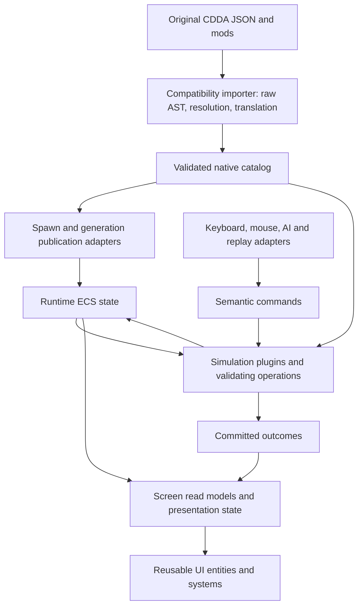

# ECS modularity and CDDA JSON compatibility plan

Status: catalog seam and retained menu-row batches delivered in the working tree. The [baseline and capability report](ecs-compatibility-baseline.md) records pinned content and remaining limits. This is a staged roadmap; the later acceptance gates below are not all complete.

Implemented: native cdda_catalog and explicit inventory/recipe translation with diagnostics; strict native publication and retained output snapshots; simulation dependency isolation; adapter-owned input/context/presentation types; populated transactional craft output; generic cdda_ui extraction; retained keyed rows for crafting, character, Settings, registry and spawn; catalog/interaction separation and cached membership; typed registry input/presentation; fixed headings, independent detail invalidation, and stable selection on catalog refresh; counted-solid pocket capacity, unified native/legacy whole-stack transfers, explicit stack merges and nested crafting access; shared activity/action budgets and native craft ingress; independent base combat components, native lifecycle controls and examine-command consolidation.

Still pending: adoption of strict publication by the broad app loader, general actor/AI reference migration, full native gameplay saves, specialized inventory/creation-placement semantics, shared activity budgets, and local-submap lifecycle. These are separate batches, not guarantees supplied by the initial catalog seam.

## Objective and scope

Build native ECS gameplay with granular ownership, reusable presentation components, and a translation boundary that can import original CDDA content. Compatibility means progressively verified data semantics, not reproduction of CDDA's class hierarchy. Original save-game compatibility is a separate project; this plan preserves native saves and imports content JSON.

Do not split every scalar into a component or create a crate for every subsystem. Split when query access, mutation ownership, lifetime, cardinality, or measured contention differs. Keep tightly coupled values together and use dense storage for dense data.

## Findings from the baseline snapshots

| Evidence | Architectural implication |
|---|---|
| Original [`Character`](../../Cataclysm-DDA-master/src/character.h), [`item`](../../Cataclysm-DDA-master/src/item.h), and [`game`](../../Cataclysm-DDA-master/src/game.h) expose broad responsibilities through inheritance and large object APIs. | Preserve their gameplay rules through focused operations and systems, rather than introducing equivalent `CharacterService` or `ItemSystem` objects with unrestricted world access. |
| Original [`itype.h`](../../Cataclysm-DDA-master/src/itype.h) already separates item definitions into capability slots; [`submap.h`](../../Cataclysm-DDA-master/src/submap.h) uses tile arrays. | Keep useful composition and dense tile storage. ECS does not require one entity per tile or one entity per immutable definition field. |
| Original [`generic_factory.h`](../../Cataclysm-DDA-master/src/generic_factory.h) resolves inheritance through typed objects and field readers; [`init.cpp`](../../Cataclysm-DDA-master/src/init.cpp) dispatches loaders and deferred loading. | A generic JSON merge alone cannot establish compatibility. Defaults, supported patch operations, units, load order, and type-specific finalization need conformance tests. |
| Original [`activity_actor.h`](../../Cataclysm-DDA-master/src/activity_actor.h) specifies start/tick/finish and serialization. | Translate those lifecycle responsibilities into activity state and ordered systems with explicit interruption/resume policies. |
| Rust [`actor.rs`](../crates/cdda_components/src/actor.rs) and [`item.rs`](../crates/cdda_components/src/item.rs) already use relationships for skills, effects, bionics, and pockets. [`runtime/plugin.rs`](../crates/cdda_sim/src/runtime/plugin.rs) provides a shared headless schedule. | Evolve these foundations instead of restarting the rewrite. Relationship maintenance still needs domain validation for ownership, capacity, and resource costs. |
| At baseline, cdda_sim depended on raw definitions and the combined loader/catalog crate, and cdda_components included the input framework. The current [simulation manifest](../crates/cdda_sim/Cargo.toml) isolates these as dev-only fixtures. | Import, input, and runtime contracts remain coupled through dependencies even where file boundaries look clean. |
| [`CraftState` and `CategoryIndex`](../crates/cdda_render/src/render/crafting_state.rs), originally in simulation, contain filtering, tabs, focus and display text. Character presentation has broad component invalidation in [`character.rs`](../crates/cdda_render/src/render/character.rs). | Move menu state into presenters and split read-model extraction from widget synchronization. Retain virtual lists, but invalidate only affected views. |
| [`def_world.rs`](../crates/cdda_data/src/def_world.rs) already has category-qualified keys, recipe registration, and a generation counter, but rebuilds despawn old definition entities. [`DefOrigin`](../crates/cdda_components/src/item.rs) is a numeric origin. | Extend existing identities; do not reimplement them. Validate and migrate references before publishing a new generation. Audit numeric origins and cached entities. |
| [`resolve.rs`](../crates/cdda_data/src/resolve.rs) and existing [bridge tests](../crates/cdda_data/tests/bridge_resolved.rs) provide import infrastructure. | Retain and strengthen the translation layer. Round-trip preservation, successful parsing, and implemented gameplay are separate guarantees. |

The first batch reconciles stale identity, dependency, schedule and test-discovery statements in CURRENT_ARCHITECTURE.md and TARGET_ARCHITECTURE.md.

## Target boundaries

The arrows show data flow, not unrestricted mutual crate dependencies. Proposed dependency ownership:

- `cdda_core_types`: stable IDs, units, coordinates, domain values; no input framework or UI.
- `cdda_defs_raw`: compatibility syntax/AST only; no runtime dependencies. Unknown-field retention must be explicit and tested, not inferred from a field named `extra`.
- New `cdda_catalog`: immutable normalized definitions, typed references, generation metadata, validation-facing contracts; no filesystem, asset watching, renderer, or raw AST.
- `cdda_data`: compatibility parsing, mod resolution, translation, diagnostics, and existing publication adapters, depending on catalog and ECS contracts. Split importer/publication modules before deciding whether they need separate crates.
- `cdda_components`: native gameplay components, relationships, semantic requests/outcomes, and simulation schedule contracts. Move keybindings, screen contexts, and display focus into adapter-owned types as consumers migrate.
- `cdda_sim`: small domain plugins, typed queries, pure calculations, and invariant-preserving commits; depends on catalog and native contracts, not raw schemas or asset loading.
- `cdda_render`: game-specific screen presenters, catalog formatting, and world visuals.
- `cdda_ui` (extracted): generic list/selection/scroll/header/detail-layout widgets. Depend on Bevy UI/ECS only as needed; never depend on recipes, `GameAction`, `Ctx`, or simulation. Input adapters translate actions into widget requests.
- App owns composition and lifecycle. Keep the existing independent `cdda_htn` planner boundary.

## Component and system design rules

| Concern | Proposed treatment |
|---|---|
| Item definition vs instance | Shared immutable catalog data behind typed `DefinitionRef<Item>`; instance components hold damage, charges, location, and other mutable state. Spawn bundles install valid capability combinations. |
| Gun definition | Normalize ammunition compatibility, fire modes, reload specification, and ballistic data into cohesive catalog records. Runtime chamber/magazine/reload progress have independent ownership. Do not split immutable data solely to increase component count. |
| Actor combat | Separate independently updated attack capability, defense, and derived equipment protection where queries justify it. Keep related damage values together. Document the authoritative inputs of every derived cache. |
| Skills/effects/pockets | Keep relationship entities where they have independent state or lifecycle. Use compact collections for immutable requirement alternatives and definition tables. |
| Inventory location | Define one authoritative location invariant across ground, pocket, worn, and wielded states. Pick a representation through the inventory slice; validated transfers must prevent cycles, duplicate ownership, overcapacity, and double costs. |
| Activities | Activity entities contain actor/target relationships, typed definition references, progress, and work requirements. Systems handle prepare, advance, complete, cancel, and resume through the shared action budget. |
| UI | Per-pane list source, visible range, selection, and scroll state; fixed header siblings; pooled/reconciled row entities. Selection updates styling/detail; scrolling updates the row window; model changes update affected labels. |

Use `Query`/`SystemParam` for bounded access. Bevy `Commands` remain suitable for deferred independent structure changes; contested operations may need synchronous commits so later actors see earlier results. Keep explicit schedule ordering. Use messages for requests/outcomes and observers for bounded local reactions, not hidden global gameplay scheduling. Choose table vs sparse-set storage using measured churn and query patterns.

## JSON compatibility contract

Pipeline: source documents + provenance → versioned raw records → CDDA resolution semantics → normalized native catalog candidate → reference/capability validation → generation publication.

1. Pin a reference revision or content digest and the ordered mod set. Never promise compatibility with an unspecified moving upstream.
2. Preserve original document values and provenance separately from resolved values. Preserve unknown fields for tooling, but report unimplemented behavior. Byte-identical export requires retaining original text; semantic round-trip is a different promise.
3. Test abstracts, aliases/migrations, duplicate overrides, `copy-from`, `extend/delete/relative/proportional`, units/rounding, translation objects, recipe composite IDs, references, and category-specific defaults. Match upstream semantics per family rather than assuming every operation is universally supported.
4. Assign explicit outcomes: supported; preserved but unimplemented; rejected. Report file, JSON path, mod, definition key, and reason. Strict playable-content validation rejects required unsupported behavior; inspection mode can retain it without pretending it works.
5. Translate known flags and action IDs into native capabilities and validated operation IDs. Complex `use_action`, effects-on-condition, dialogue, and mapgen require dedicated compilers/interpreters or explicit unsupported reports; they are not enabled by deserialization alone.
6. Stage the entire candidate dependency graph before altering the active generation. For live references choose migrate, retain the old generation, or cancel with an outcome. Persist stable definition keys and simulation IDs, never Bevy entity bits or incidental interner order.

## Delivery sequence and acceptance gates

| Phase | Work and boundary | Completion evidence |
|---|---|---|
| 0 — Baseline | Record reference/content hashes and mod order; inventory component owners, dependency edges, cached references, and current compatibility coverage. Reconcile stale architecture notes. | Checked-in compatibility manifest and capability report; repeatable headless fixtures; current UI/simulation regression baseline. |
| 1 — Catalog seam | Extract normalized catalog contracts from `cdda_data`; make raw-to-native translation explicit. Migrate one item/recipe family, then remaining simulation consumers. | Simulation dependency graph excludes raw schemas, input framework transitively, and asset/filesystem loading after migration. Fixtures verify normalized values and unresolved-reference diagnostics. |
| 2 — Identity/publication | Build on existing category keys/generation counter. Audit `DefOrigin`, item refs, recipe/activity refs, and AI plan refs. Add candidate validation and migration policy. | Failed reload preserves the complete active state. Reload during craft/plan and native save/load across reordered definitions retain meaning. |
| 3 — Inventory and crafting slice | Import a container, ingredient, tool, recipe, and result; use granular instance components and validated transfer/crafting operations. Remove the placeholder craft-result spawning path. Move `CraftState`/`CategoryIndex` presentation fields above simulation. | Headless import → spawn → pickup → craft → save/load scenario; competing actors cannot double-consume; rejection charges nothing; cancellation/resume and result spawning are correct. |
| 4 — Actor/activity ownership | Separate independently owned combat data; consolidate legacy mutation paths; align activities and actions with one budget. Keep skills/effects relationships. | Per-domain read/write ownership map; production-schedule budget, contested action, effect removal, and interruption tests. No alternate mutation path bypasses validation. |
| 5 — Reusable ECS UI | Extract generic primitives to `cdda_ui`; presenters project gameplay into per-pane read models. Replace broad invalidation and row subtree replacement with targeted reconciliation/reuse. | Crafting, character, Settings, registry, and spawn use the same generic widgets; no gameplay dependencies in `cdda_ui`; fixed headers, bounded node counts, and no idle UI writes. Selection does not reformat an entire catalog. |
| 6 — Compatibility expansion/world lifecycle | Extend supported content families in vertical slices. Establish local submaps, activation/catch-up, and native persistence before advanced mapgen/world behavior. | Coverage grows for the pinned original corpus; differential fixtures for supported semantics; region leave/reenter and deterministic command replay tests. Unsupported families stay visible in reports. |

Phases 1–3 establish the core seam. Phase 5 may follow phase 1 while the gameplay slices proceed, provided presenters use native contracts. Each phase should be multiple reviewable changes, with deprecated adapters removed after all consumers migrate; avoid an all-at-once rewrite.

## Player-visible compatibility gate

The [master semantics audit](master-semantics-audit.md) found that the implemented
BR behavior is not equivalent to master. The delivery checkpoints below describe
architecture and native regression coverage, not parity. The first reconciliation
slice now matches master-derived neutral craft spending, partial TIME rounding and
player input/world-time scenarios. Crafting checks/modifiers, reach, item handling
and other recorded differences still block general equivalence.
Reconcile the audit's supported-family differences before expanding gameplay.

## Current delivery checkpoint

Phase 5's shared-list adoption is delivered: all five named screens use cdda_ui
row geometry, selection reveal and keyed row recycling. Registry source extraction
is isolated from typed input/presentation systems, and both debug browsers keep
catalog data separate from interaction state. Headers/details survive scrolling;
empty registry categories clear stale details. Headless tests use 40,000-entry
fixtures, validate same-frame selection reveal and native fixed-header geometry,
and check retained entity identities and unchanged idle/text ticks. Initial source
projection/filter changes remain O(N); this is not a wall-clock latency guarantee.

The counted-solid inventory transfer slice is delivered. Native Transfer intents
and legacy whole-stack messages share live validation/commit and AP charging.
Projected destination/ancestor loads include occupied volume/weight and counts;
reparenting within an ancestor does not double-count the moving stack. Explicit
colocated merging no longer hides inside letter assignment. The imported bag
fixture now exercises capacity rejection, nested ingredient consumption and reuse
of freed space. Sealing/unmounting also refreshes crafting availability in the UI.

Source evidence: original [item_pocket.cpp::_can_contain](../../Cataclysm-DDA-master/src/item_pocket.cpp)
checks item and remaining volume/weight separately and gives special semantics to
ammo-restricted pockets. This slice implements counted solids with ordinary
container pockets. Specialized restrictions, fluids/charge dimensions and partial
stacks are rejected explicitly; broad upstream containment parity is not claimed.
Direct spawning and craft-result placement still need a capacity/overflow policy.

The activity/action budget slice is delivered. SimulationActivity runs typed
systems for the selected actor alongside SimulationAction arbitration. Speed-based
craft/aim/reload work spends available AP; time-based reading/waiting/interaction
spends the turn budget without accelerating elapsed time. A partial final slice
leaves its remaining AP for an action. Each actor has a bounded selection count;
100-actor fixtures verify the bound does not silently skip a large group.

Source evidence: original [player_activity.cpp::do_turn](../../Cataclysm-DDA-master/src/player_activity.cpp)
distinguishes TIME work (100 progress and the actor’s turn budget) from SPEED work
(available moves, capped at remaining work). Native aiming/reload effects remain
approximations; this establishes budget accounting, not full upstream behavior.

PendingCraft now translates to StartCraft intent before arbitration, retaining
actor priority and preventing ingredient consumption without an eligible budget.
Started and completed craft notifications remain separate. Interruption preserves
saved work; resume and completion verify ownership/access, and incomplete crafts
cannot mint output. Typed systems require one activity type/progress pair.

The base combat ownership slice is delivered. MeleeCapability, DodgeDefense and
IntrinsicArmor have independent runtime lifetimes; CombatStats remains a plain
adapter record with explicit conversion. The character screen handles each optional
capability's changes/removals independently. The JSON projection preserves the
original dodge field instead of incorrectly copying melee dice.

| Data | Authoritative writer | Readers / invalidation |
|---|---|---|
| Base melee capability | Actor construction / explicit capability edits | Combat formula helpers and character presenter |
| Base dodge | Actor construction / explicit capability edits | Character presenter; future combat resolver |
| Natural protection | Actor construction / explicit capability edits | Character presenter; future mitigation |
| Equipment/effect modifiers | Pending domain-owned derivation | Must not overwrite base components or become another mirror |
| Activity control | Native intent resolution and lifecycle operations | Activity scheduler, correlated ActionOutcome, CraftRevision/presentation |

Source evidence: [monstergenerator.cpp](../../Cataclysm-DDA-master/src/monstergenerator.cpp)
loads dodge separately from melee dice; [monster.cpp::absorb_hit](../../Cataclysm-DDA-master/src/monster.cpp)
combines intrinsic resistance with worn protection at mitigation. This split does
not claim full combat formulas or equipment parity.

InterruptActivity and ResumeCraft now resolve before selected activity work,
retaining saved progress and returning correlated outcomes. Item-examine input
moved from shell mutation code to a typed presenter: it submits validated item and
resume commands without draining the input stream. Planner drivers preserve
submitted commands; external commands discard the previous HTN plan.

Timing reconciliation delivered: craft ticks spend all available moves even when
finishing; partial TIME costs truncate, with zero-cost completion still allowing
a queued action. TurnBased player commands reuse spare moves without another
world tick or effect decay, and defer AI until player moves are spent. Pending
menu requests run in SimulationIngress; inventory/spatial refresh follows commits
in SimulationRefresh. Explicit/manual/realtime steps retain forced-turn semantics.

Next implementation slice: reconcile crafting reach/access, then supported recipe
eligibility, continuation and output as prioritized in the semantics audit. Native melee
execution, equipment/effect modifiers and remaining activity-start commands stay
after that compatibility gate (phase 4).
Persistence, broader publication/reference migration and direct creation capacity
policies remain pending. Base-component decomposition does not implement combat
verbs or guarantee native save/load.

## Verification and performance budget

Use `cargo nextest run` with production headless schedules, plus workspace compilation and dependency inspection. Extend existing data bridge/round-trip suites; they are not substitutes for behavior tests. Where feasible, compare focused fixtures with original CDDA's loaders/tests; otherwise record the upstream behavior and expected normalized result explicitly.

Measure import time, definition memory, action throughput, UI entity counts, idle mutations, and row-update allocations with fixed fixtures. For a list of N rows and viewport V, target O(V + overscan) UI entities and window updates, O(1) selection styling changes, and no O(N²) category filtering. Initial import/filtering may remain O(N). Set wall-clock budgets after recording hardware/build configuration, rather than inventing thresholds now.

First implementation batch (implemented): baseline audit plus the catalog/import seam for the inventory–crafting slice, with reusable UI crate extraction. Preserve the working virtual menus throughout. Keep unimplemented compatibility and migration guarantees explicit until their acceptance gates pass.
